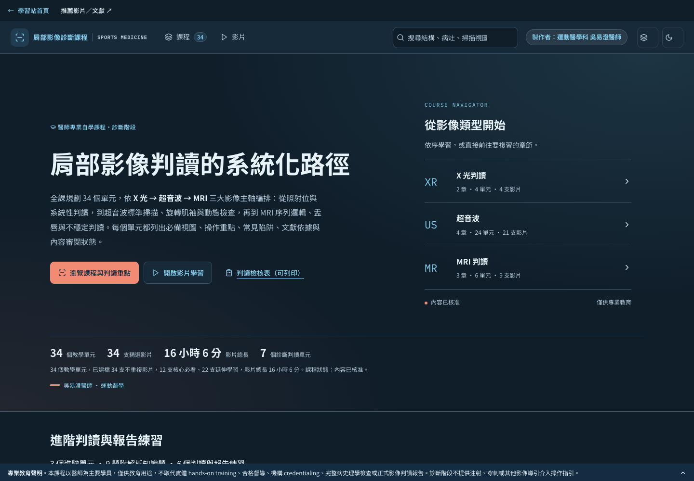

# 肩部影像診斷課程

以醫師為主要學員的肩部影像自學課程，涵蓋肌肉骨骼超音波、X 光與 MRI 三種模態，依 ACR、AIUM、ESSR 與台灣 USMSIT/NMUSIT 等專業指引建立標準掃描與照射位、序列判讀、常見病理與報告品質的學習路徑。

[開始學習](https://shoulder-imaging.sportsmedicine.tw/) · [七站總覽](https://imaging-course-hub.sportsmedicine.tw/) · [吳易澄醫師](https://sportsmedicine.tw/)

**原始碼狀態：公開。歡迎參考、回報問題與提出技術 PR。** 網站可瀏覽與 repo 是否公開是兩個獨立設定。



[手機畫面](docs/images/mobile.png) · 畫面與資料快照：2026-09-10。

## 可以參考什麼

- 資料驅動的課程與影片來源整理，維持可追溯的單元、來源及版本資訊。
- 繁體中文、手機版面與預設深色設計；使用者可切換並保存主題偏好。
- 各課程左上方可返回學習站，並透過「推薦影片／文獻」提供連結或回報修正。
- 教材與研究包分開管理；策展審閱、技術驗證與臨床能力認證不混用。

## 現有資料

以下依 2026-09-10 本機正式建置統計；資料量與影片時數不能證明臨床能力。

| 項目 | 數量 |
| --- | --- |
| 章節 | 9 |
| 主課程單元 | 34 |
| 不重複影片 | 34 |
| 已輸出逐段筆記 | 414 |
| 主課程知識檢核題 | 0 |
| 已發布進階單元 | 3（另含 9 題） |

完整範圍與限制見 [DATA_AND_REVIEW](docs/DATA_AND_REVIEW.md)。零筆代表目前未提供該類資料，不表示建置失敗。

## 本機建置

需要 Python 3.11+、uv；`make check` 的 JavaScript 語法檢查另需 Node.js。

```bash
uv sync --locked
make check
make serve PORT=8899
```

開啟 http://127.0.0.1:8899/ 。只建置靜態網站時可直接執行 `python3 src/build/build.py`，不需要 Cloudflare 帳號或憑證。

瀏覽器測試、資料更新及不需正式服務的驗證方式見 [開發說明](docs/DEVELOPMENT.md)。部署設定見 [DEPLOYMENT](docs/DEPLOYMENT.md)。

## 檔案入口

| 路徑 | 用途 |
| --- | --- |
| `course/course.config.json` | 網站、課程與稽核設定 |
| `course/data/` | 課綱、影片中繼資料、筆記、題目與名詞表 |
| `course/research/` | 候選與審閱包；草稿不等於已發布教材 |
| `src/web/` | 原生 HTML、CSS、JavaScript |
| `src/build/` | 建置、來源及範圍稽核 |
| `tests/` | 結構與互動回歸檢查 |

## 提供影片、文獻或修正

從網站「推薦影片／文獻」進入表單，會自動附上課程與單元網址。可提供公開影片、DOI／PubMed／學會文獻連結或資料修正；投稿須先查核，不會自動上線。請不要提供病人個資或未獲授權的影像。

程式與介面 PR 請讀 [CONTRIBUTING](CONTRIBUTING.md)；安全問題請依 [SECURITY](SECURITY.md) 私下回報。Fork 與改作請讀 [FORKING](docs/FORKING.md)，重新設定作者、網域與投稿目的地。

## 授權與引用

程式碼維持 MIT；原創教材未新增重製或改作授權。 詳見 [LICENSE](LICENSE)、[教材授權範圍](LICENSE-CONTENT.md) 與 [第三方及品牌聲明](NOTICE.md)。第三方影片、文獻與素材維持原權利人的條件，本站不代為授權。

引用專案可使用 [CITATION.cff](CITATION.cff)，並註明實際使用的 commit 或版本。引用臨床結論時，請直接引用原始文獻；專案引用不取代文獻引用。

## 使用範圍

供醫療專業人員教育使用。策展審閱確認收錄範圍、來源及課程編排，不代表對第三方影片內容的醫療背書；模型檢查或測試通過也不等於醫師逐項審閱、專業認證或獨立執業資格。使用時仍需實作訓練、合格督導與臨床判斷。

## 系列網站

| 課程 | 學習網站 | 原始碼 |
| --- | --- | --- |
| 髖關節 | [進入網站](https://hip-imaging-course.pages.dev/) | 私有，未開放 |
| 踝與足 | [進入網站](https://ankle-foot-imaging-course.pages.dev/) | 私有，未開放 |
| 肩部 | [進入網站](https://shoulder-imaging.sportsmedicine.tw/) | [GitHub](https://github.com/keanu77/shoulder-imaging-course) |
| 頸椎 | [進入網站](https://cervical-imaging-course.pages.dev/) | 私有，未開放 |
| 腰椎 | [進入網站](https://lumbar-imaging-course.pages.dev/) | 私有，未開放 |
| 腕與手 | [進入網站](https://wrist-hand-imaging-course.pages.dev/) | 私有，未開放 |
| 膝關節 | [進入網站](https://knee-imaging.sportsmedicine.tw/) | [GitHub](https://github.com/keanu77/knee-imaging-course) |
| 課程總覽 | [進入網站](https://imaging-course-hub.sportsmedicine.tw/) | 私有，未開放 |

[文件索引](docs/README.md) · [先前課程說明](docs/COURSE_GUIDE.md)
